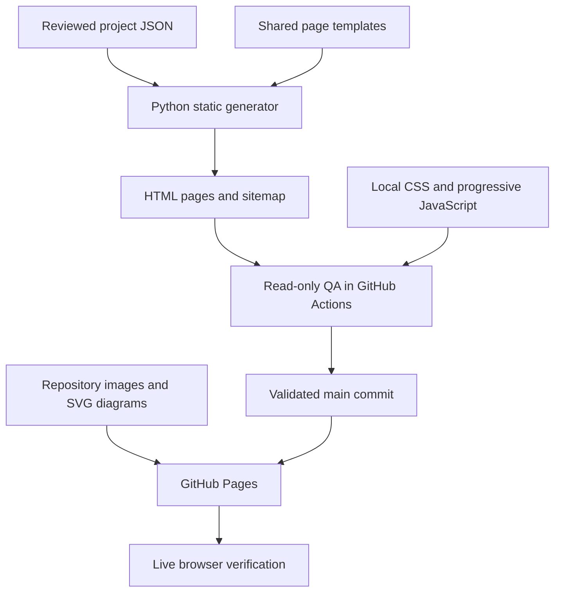

# Robotics portfolio redesign — delivery plan and milestones

Owner: Samarth Patel. Implementation coordinated across portfolio strategy, robotics audit, information architecture, UI/UX, robotics motion, frontend architecture, performance/accessibility, technical writing, visual assets, and QA specialists.

Last updated: 16 September 2026.

## Goal and constraints

Deliver a polished, recruiter-readable robotics engineering portfolio with deep technical case studies. Complete implementation, testing, GitHub Pages deployment and live verification. GitHub remains the source of truth; existing hosting and direct project URLs are retained. No external runtime assets or services. Preserve original images and keep project visuals separate from architecture diagrams. Never invent achievements or promote planned work as implemented.

## Milestone tracker

| Milestone | Status | Acceptance evidence |
|---|---|---|
| M1 — Baseline and rollback | Complete | Audited main `d2efd1781c07c497fcd8147e38e4aae4f08fb66c`; backup branch `backup-before-portfolio-redesign-2026-09-15` exists. Original live site unchanged during development. |
| M2 — Technical and image audit | Complete | All 13 projects reviewed; source-level IIoT corrections; image manifest records dimensions, file sizes, provenance and decode failures. Three valid industrial images recovered from existing repository history. |
| M3 — Strategy and design system | Complete | Summary-first identity, three featured case studies, capability evidence links, separate experience/project hierarchy. Graphite/cyan system with restrained robotics motion. |
| M4 — Complete static implementation | Complete | 21 generated documents including 13 project case studies, homepage, projects, experience, skills, about, printable résumé, Forage experience and 404. Shared generator, data, styles and progressive JS. |
| M5 — Content and asset integration | Complete | All existing project routes and detailed objectives retained; IIoT reviewed diagram added; images separated from diagrams; simulation and development boundaries explicit. Original binary image blobs unchanged. |
| M6 — First browser and visual verification | Complete | Commit `d0c69518e1810235c1778b860cccb6c4dfd48d0c`; GitHub Actions run `35070804270` passed. 21 route visits, 390/768/1440px screenshots, no reported browser/axe/image/overflow/interaction failures. Screenshots reviewed. |
| M7 — Release regression | Complete | Release `38dba1a0253fac74efce456d9615f1a8f920f20c`; [run 35119941301](https://github.com/SAMP2411/SAMP2411.github.io/actions/runs/35119941301) passed after correcting reverse-Tab focus wrapping. Includes no-JS, keyboard, responsive, image and 404 checks. |
| M8 — GitHub Pages deployment | Complete | Validated release fast-forwarded to main. [Pages run 35120177478](https://github.com/SAMP2411/SAMP2411.github.io/actions/runs/35120177478) completed successfully for the exact release commit. |
| M9 — Live validation and handoff | Complete | Live homepage, motion pause/resume, project filtering, quick view, IIoT architecture and recovered capstone image verified in browser on 16 September 2026. [Verification report](docs/verification-report.md) records evidence and limitations. |

Update this table when each milestone passes. A milestone is complete only with observed evidence; green unrelated CI is not deployment verification.

## Architecture

| Layer | Files | Responsibility |
|---|---|---|
| Content | `data/projects.json` | Project summaries, status, objectives, contribution, implementation, validation and source links. |
| Build | `scripts/build_site.py` | Deterministic static pages; shared navigation, metadata, cards and case-study sections. |
| Visual system | `site.css`, `refinements.css` | Responsive typography, spacing, surfaces, cards and accessible states. |
| Interactions | `site.js` | Mobile menu, domain filtering, URL synchronization and native-dialog quick views. |
| Robotics scene | `assets/robotics-scene.svg`, `scene.css`, `scene.js` | Dimensional arm/AMR illustration with lightweight motion and static fallback. |
| Media | `assets/`, original project photographs | Repository-only image and diagram assets; originals retained. |
| QA | `scripts/validate_site.py`, `scripts/browser-test.mjs` | Static references, browser errors, image decoding, axe accessibility, responsive overflow, keyboard, no-JS and 404 checks. |
| CI | `.github/workflows/patch-homepage.yml` | Read-only tests and screenshot/report artifacts; replaces the legacy mutating generator. |

## Decision log

- Retained static HTML and existing `.html` paths rather than introducing SPA routing or a framework runtime.
- Chose one dimensional SVG/CSS robotics scene rather than a heavy WebGL dependency. Pause, reduced motion, offscreen and hidden-tab states are supported.
- Preserved the original deployment while validating the redesign branch.
- Preserved original binary files, including corrupt historical files, and referenced valid existing high-resolution variants under distinct names.
- Existing AI imagery is illustrative and was previously upscaled; no claim of native photographic evidence is made.
- Kept the résumé as an honest printable web edition because no original downloadable CV exists in the repository.
- Removed unsupported numerical performance claims from promotional copy; preserved documented engineering detail with clear scope.

## Validation procedure

1. `python3 scripts/build_site.py` — regenerate all pages.
2. `python3 scripts/validate_site.py` — check structure, internal paths, anchors and assets.
3. GitHub Actions installs development-only browser tools and tests the static server at three widths.
4. Inspect screenshots and report; fix concrete failures before promotion.
5. Fast-forward main to the validated commit; retain backup branch.
6. Observe Pages deployment completion and verify actual live pages.

## Delivery status

All nine milestones are complete. Live site: https://samp2411.github.io/. The tested implementation release is `38dba1a0253fac74efce456d9615f1a8f920f20c`; subsequent handoff documentation commits do not change that implementation.

## Documentation index

- [Release verification and handoff](docs/verification-report.md)
- [Engineering decisions and maintenance](docs/engineering-decisions.md)
- [Robotics technical audit](docs/technical-audit.md)
- [Visual asset audit](docs/asset-audit.md)
- [Asset provenance manifest](docs/asset-manifest.json)
- [Decoded image dimensions](docs/image-dimensions.json)

## Rollback

Restore the backup tree in a new main commit if deployment catastrophically fails. Do not delete the backup, force-push main or erase history. The original main commit is `d2efd1781c07c497fcd8147e38e4aae4f08fb66c`.

## Follow-up — simpler browsing

User feedback: centered layouts and separate pages made the portfolio difficult to scan. Replaced the three-project homepage preview with all 13 projects in a compact, wider grid. Primary navigation now jumps to homepage sections; full experience and a short About section are available there. Quick views retain context and case-study URLs remain available for deeper reading. The project explorer uses the same compact cards. B. Braun content remains unpublished.

Compact overview validation: GitHub Actions run `35122232315` passed at 390/768/1440px. Desktop screenshot review confirmed all 13 cards in five columns and three rows; final polish restores name spacing and keeps the scene control visible.

## Card proportion refinement — 24 September 2026

Replaced narrow full-height image strips with square 96px thumbnails (104px on phones), consistent 16px internal spacing, 20px grid gutters, flexible untruncated headings and bottom-aligned actions. Grid adapts through four, three, two and one columns. Existing images and project content remain unchanged; no assets generated or integrated for this update.
